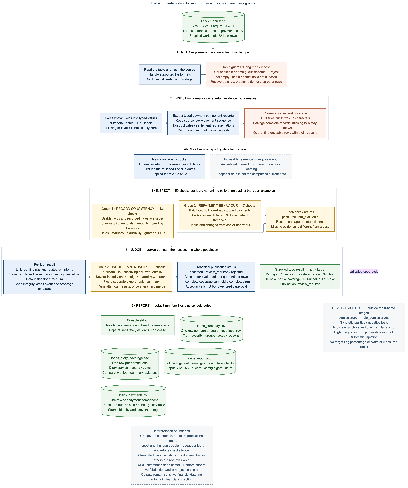
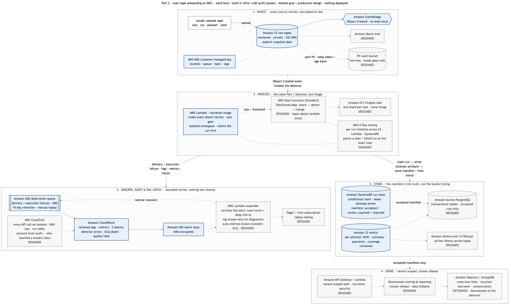

# Loan-tape quality: from lender file to auditable results

**Exaloan platform-engineer take-home.** A Python detector compares loan summaries with
payment histories. A representative AWS ingestion path runs the same code, preserves
provenance and gates publication. No infrastructure is deployed.

## 1. Approach: reconcile facts, preserve uncertainty



[Mermaid source](docs/pipeline.mmd) · [SVG](docs/pipeline.svg) · [stage-by-stage walkthrough](docs/pipeline.md)

With 72 loans and only three labelled examples, explainable accounting/date rules are
more defensible than a trained anomaly model. The approximate anomaly percentage is
**not a target**. No LLM runs in the detection path.

```text
Read → ingest once → anchor snapshot → evaluate rules → judge evidence → report / hold
```

1. **Read** the file and validate its headers.
2. **Ingest** required values and parse the diary into typed child rows with source identity.
   Quarantine unusable rows; salvage complete records from the 13 truncated diaries.
3. **Anchor time:** local inference gives 2025-01-23; `--as-of` overrides it. Production
   requires a supplied snapshot date, not today's clock or upload time.
4. **Evaluate** the inspection groups below, with documented rounding, settlement and
   evidence-sufficiency guards. Whole-tape checks use the full population after loan results.
5. **Judge** evidence and linked symptoms, keeping data integrity, credit events and coverage
   separate. Review uncertain cases; never automatically rewrite financial records.
6. **Report** traceable results; publication eligibility can hold a technically successful run.

### Three inspection groups

| Group | Checks | Plain-English question |
|---|---:|---|
| **Record consistency** (`record_consistency`) | 43 per loan | Do the fields, amounts, dates and status tell a consistent, plausible story? |
| **Repayment behaviour** (`repayment_behaviour`) | 7 per loan | Is the borrower paying late, remaining overdue or changing payment habits? |
| **Whole-tape quality** (`whole_tape`) | 6 whole-file | Do records agree across the file, and are there population-wide quality concerns? |

These are rule groups, **not three processing stages**. Readability issues remain visible
through record-consistency rules using ingestion evidence, without parsing again. Stable
rule IDs retain traceability; [group details and examples](docs/pipeline.md#4-three-inspection-groups)
explain the distinction between contradictory records and genuine late payment.

## 2. Results and their meaning

| Tier | Loans | Interpretation |
|---|---:|---|
| Major / flagged | 15 | Evidence crosses the configured severity threshold. |
| Minor | 10 | Visible observation or contract-dependent review, not a major flag. |
| Indeterminate | 13 | Incomplete coverage; missing evidence is not a clean result. |
| Clean | 34 | No material issue found within applicable checks and available evidence. |

Two major loans also have incomplete receipt timing: coverage overlaps severity, but tiers do not.

**Examples:** 37216892 has EUR 755.66 of instalment components 90+ days overdue;
94863476 says repaid but retains EUR 806.68 pending; 65318525 has a EUR 4,664.53 principal
gap. On 79811839, net overdue-interest receipts reconcile: retain its paid/pending
contradiction, not an invented extra accounting gap. 14146974's zero realised interest
needs early-settlement terms before calling it an error. 76669736 paid EUR 12.58 ordinary
interest; its principal gap is stronger evidence than an independent rate-defect claim.

[Console](reports/loans_console.txt) gives one reason per loan; [JSON](reports/loans_report.json)
contains every finding, rule outcome and provenance. [Summary](reports/loans_summary.csv),
[payments](reports/loans_payments.csv) and [coverage](reports/loans_diary_coverage.csv) provide
traceable tables. A flag is not proof of fraud or borrower misconduct. Without the complete
seed list, precision/recall cannot be measured.

## 3. Run and verify

Use Python 3.12 and [uv](https://docs.astral.sh/uv/). Dependencies and hashes are locked
with a recorded release-review cutoff.

```bash
uv sync --locked --all-extras
. .venv/bin/activate
loan-dq run data/loans.xlsx --out reports
pytest -q
ruff check . && ruff format --check . && mypy
(cd infra && npx --yes aws-cdk@2.150.0 synth)
```

**Verification commands above** cover tests, lint, formatting, types and synthesis. Tests
include clean controls, injected defects, privacy, shard accounting, plugin isolation and
mocked AWS failures. Docker image execution remains a separate CI gate, not proof supplied
by synthesis. No deployment is required.

## 4. AWS: implemented versus designed



[Mermaid source](docs/architecture.mmd) · [SVG](docs/architecture.svg)

**Implemented:** versioned S3 → EventBridge → container Lambda → S3 attempt artifacts,
with DynamoDB ownership/committed manifests, KMS, CloudWatch, SQS failure capture and SNS
alarms. Exact-version reads and isolated workspaces prevent stale-input and cross-tape errors.
Conditional run ownership and a final manifest gate publication; retries cannot create
competing accepted decisions. Consumers must check `COMMITTED` and `accepted`, not list S3.
`review_required`/`rejected` retain diagnostics without automatic serving. Technical
acceptance is not borrower approval. [Input/consumer contract](infra/README.md).

**Designed:** Standard Step Functions/Fargate for large tapes, transactional Aurora loading,
a tenant-authorised API, human release, data rollback and disaster recovery. Express is
only for suitable short child workflows. These are not claimed as built.
[Architecture, recovery and cost decisions](docs/architecture.md).

## 5. Assumptions, limits and next steps

- Confirm settlement, fee, day-count and snapshot conventions; obtain complete diaries
  and adjudicated labels before claiming accuracy. Optional demographic context can stay
  unevaluated without invalidating an otherwise evaluable financial ledger.
- Sharding exists, but whole-file reads and materialised aggregation remain bottlenecks.
  Normalise once into physical partitions before scaling to millions of loans.
- Outputs minimise sensitive fields but remain personal financial data. Pseudonymisation
  is not anonymity; GDPR retention/erasure includes raw versions, results, logs and backups.
- Production needs tenant isolation, reviewed IAM/OIDC trust, authorised replay, tested
  restores and rollback of **published data**, not only code. ISO 27001 readiness requires
  governance and operational evidence; this repository is not certification.

## 6. Repository map and interview explanation

`ingest` parses; `rules` evaluates; `engine.py` coordinates; `report` explains. `tests`
challenges the guarantees; `infra` implements cloud ingestion; `bitbucket-pipelines.yml`
verifies the artifact. [Pipeline walkthrough](docs/pipeline.md) ·
[Classification scales](docs/classification.md) · [Decision history](docs/decisions.md) ·
[AI disclosure](AI_DISCLOSURE.md).

**The story:** “I compare the lender's two descriptions of each loan, separate contradictions
from credit behaviour and missing evidence, then publish a traceable result only when the
processing contract is satisfied. Retries recover operations; humans resolve uncertain data.”
